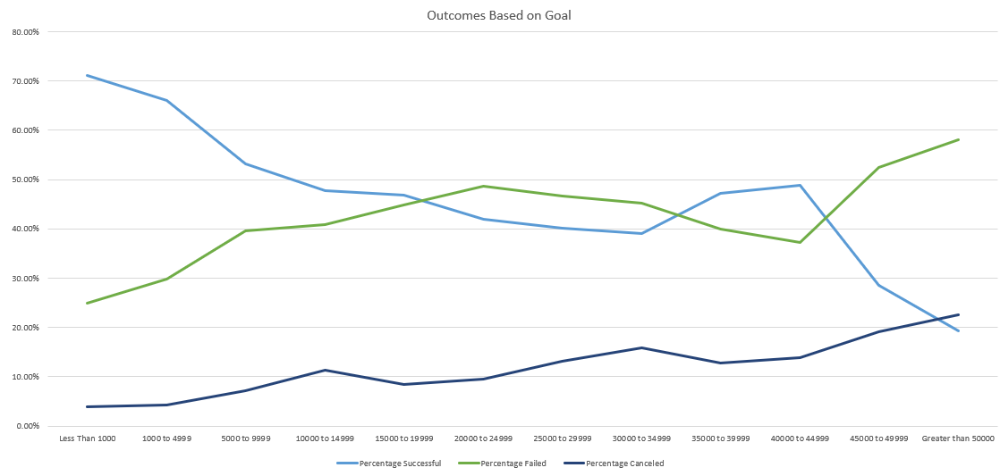
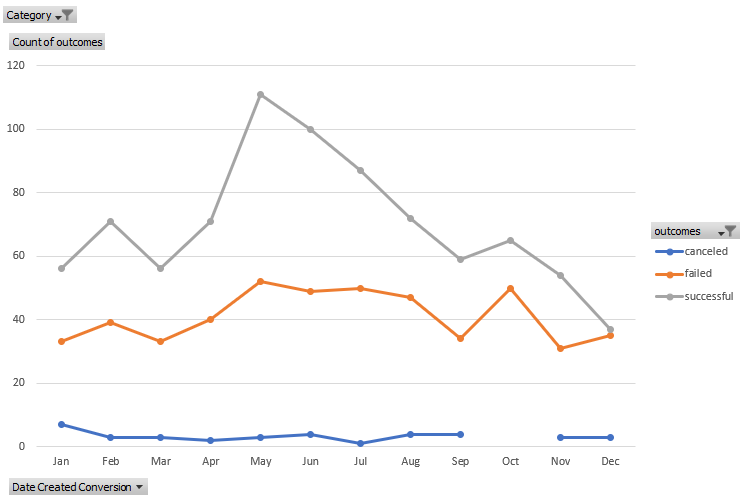

# An Analysis of Kickstarter Campaigns

Berkeley Bootcamp - Module 1

### Module 1 Challenge

The conclusions drawn from this exercise are as follows.

1. Kickstarters with goals less than $1,000 have the highest successful percentage at ~70%.
2. Once kickstarters get to the $15,000-$45,000 goal range the successful and failed rates are similar.
3. Campaigns are most successful for "Theater" when launched in May.

The analysis performed on this dataset included looking at outcomes (successful, failed, canceled) based on goal ranges for all kickstarter campaigns.  It also looked at outcomes based on launch date.

This analysis is helpful but far from complete.  The parent category was only selected for the launch date analysis. In addition other points of data like "deadlines" were not used.  This leaves the conclusion lacking a solid foundation.

I would not personally start a kickstarter based solely on the data from the previous two charts.
